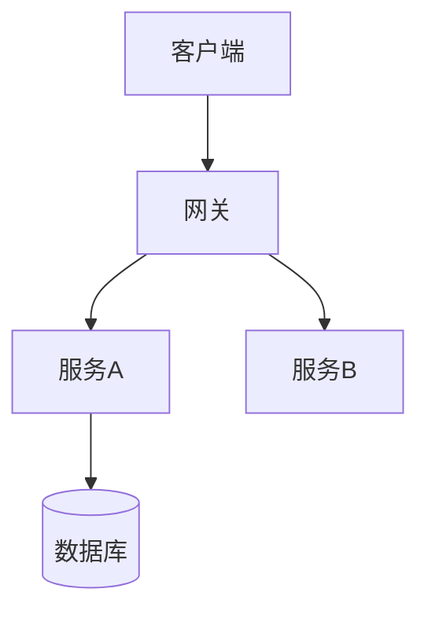

# 架构设计

## 交接说明
- **给谁**：frontend / backend / test / devops
- **一句话**：<系统整体怎么搭>
- **关键决策**：<技术选型、架构风格>
- **需要下游注意**：<约束、契约位置>
- **未决问题**：无 / Q-xxx

## 1. 架构概览
<整体架构图，mermaid>

## 2. 技术选型
| 关注点 | 选择 | 理由 | 备选 |
|--------|------|------|------|
| 后端框架 | | | |
| 数据库 | | | |
| 前端框架 | | | |

## 3. 模块/服务划分
<各模块职责、边界、通信方式>

## 4. 关键设计决策（ADR 摘要）
| 编号 | 决策 | 背景 | 后果 |
|------|------|------|------|
| ADR-001 | | | |

## 5. 横切关注点
<安全、权限、日志、监控、错误处理、配置>

## 6. 部署拓扑（供 devops）
<环境、组件、网络>

## 7. 扩展性与非功能
<性能、可用性、扩展策略，对应非功能需求>
