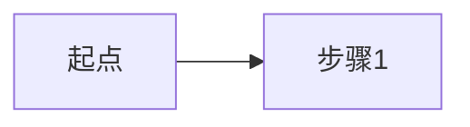

# 业务简报

## 交接说明
- **给谁**：product-manager
- **一句话**：<这个业务是做什么的，核心流程一句话>
- **关键决策**：<业务上的关键事实/约束>
- **需要下游注意**：<术语陷阱、外部依赖>
- **未决问题**：无 / Q-xxx

## 1. 业务背景
<业务领域、现状、痛点>

## 2. 核心业务流程
<用文字/步骤描述主流程，可配 mermaid 流程图>

## 3. 关键角色与场景
| 业务角色 | 场景 | 诉求 |
|---------|------|------|

## 4. 外部依赖
<第三方系统、合规要求、数据源、上下游系统>

## 5. 业务规则
<必须遵守的业务规则/约束>

## 6. 待业务方确认
<列出需要业务方拍板的问题，对应 open-questions 编号>
