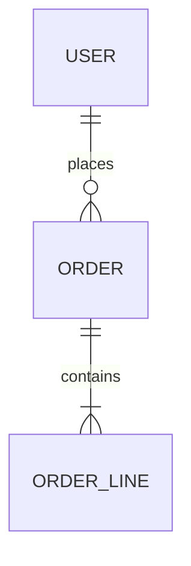

# 数据模型

## 交接说明
- **给谁**：backend / test
- **一句话**：<核心实体与关系>
- **关键决策**：<存储选型、关键索引>
- **需要下游注意**：<约束、软删除、多租户等>
- **未决问题**：无 / Q-xxx

## 1. ER 图

## 2. 实体定义

### USER
| 字段 | 类型 | 约束 | 说明 |
|------|------|------|------|
| id | bigint | PK | |
| name | varchar(64) | NOT NULL | |

- **索引**：...
- **约束/说明**：...

### ORDER
| 字段 | 类型 | 约束 | 说明 |
|------|------|------|------|

## 3. 关键关系与基数
<实体间关系说明>

## 4. 数据生命周期
<创建、更新、软删除、归档策略>

## 5. 迁移策略
<schema 变更如何管理，如 migration 工具>
